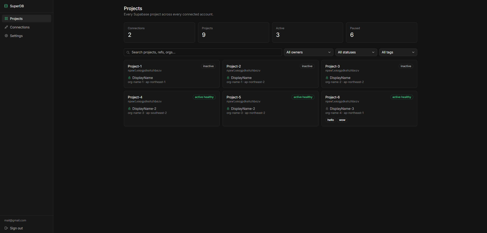
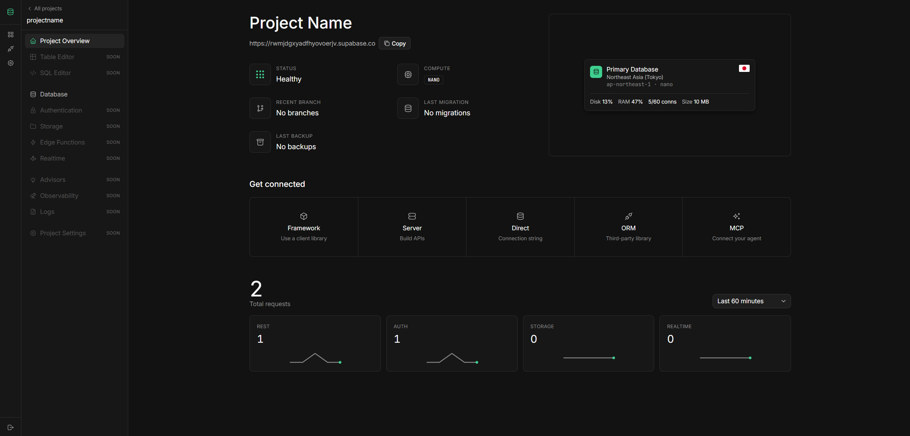
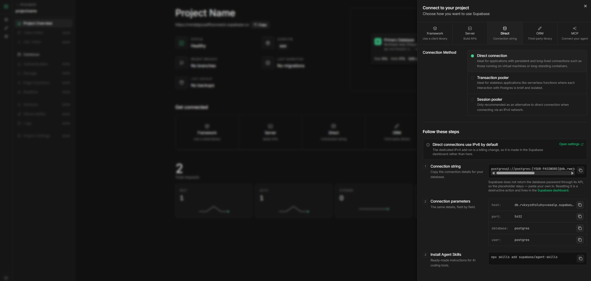

<div align="center">


# SuperDB

**Every Supabase project, across every one of your Supabase accounts, on one board.**

[](https://nextjs.org)
[](https://react.dev)
[](https://www.typescriptlang.org)
[](https://tailwindcss.com)
[](https://supabase.com)
[](https://pnpm.io)
[](https://nodejs.org)
[](LICENSE)

[What it does](#what-it-does) · [Connecting](#connecting-an-account) · [Security](#security) ·
[Self-hosting](#self-hosting) · [Development](#development) · [Docs](docs/README.md)

</div>



Supabase gives each account its own dashboard. If you hold five accounts, you hold five dashboards,
five tabs, and no way to remember which one owns which project. SuperDB connects all of them to a
single board, lets you name each account whatever you actually call it, and gives every project a
workspace shaped like Supabase's own.

> [!NOTE]
> **A note on identity.** Supabase no longer issues user-scoped tokens, so `/v1/profile` refuses
> every token this app can be handed — no automatic "which email owns this" exists any more, for
> access tokens and OAuth grants alike. SuperDB works around it: a connection is named after its
> organization by default, you can rename it to anything, and the real account email lives in the
> credential vault where you put it.

## What it does

### Across accounts

- **Projects board** — every project from every connection in one grid, with counts across the top
  and filters for owner, status and tag. Each card carries its ref, the connection it came from, the
  organization and region, and whatever tags you gave it. Drag to order it your way.
- **Naming and tags** — rename any connection; tag projects freely with a creatable picker.
- **Credential vault** — store each Supabase account's sign-in method and email, plus the passwords
  for that account and the mailbox behind it. Encrypted in your browser, never in plaintext on the
  server. See [Security](#security).
- **Open in Supabase** — every project page links to the same page in the original dashboard. The
  account chip beside the project's name says which account holds it and copies what signs in to it:
  email, account and mailbox passwords, the database password, the ref and the URL. The original
  keeps one account signed in per browser, so a project from another account needs a sign-out first
  — which is what the copy buttons are for.
- **Account safety** — TOTP two-factor, an append-only connection event log, and self-service account
  deletion that revokes every OAuth grant on the way out.

### Inside a project

A Supabase-style rail with the same sections, in the same order. What is built:

| Section | What is there |
|---|---|
| **Overview** | Status, compute, branch, migration and backup tiles; the primary database card; the Connect sheet; service usage charts read from the project's logs |
| **Table Editor** | Browse, filter, sort and edit rows; import and export; schema changes |
| **SQL Editor** | CodeMirror with PostgreSQL highlighting, tabs, saved and favourite queries, templates, examples, running queries, a results grid and a chart |
| **Database** | Schema Visualizer, Tables and their columns, Functions, Enumerated Types, Policies |
| **Authentication** | Users, OAuth Apps, Emails (templates and SMTP), OAuth Server |
| **Storage** | Buckets and files, S3, Analytics, Vectors |
| **Project Settings** | General, API Keys, JWT Keys, Password Manager |

Sections and pages not built yet stay visible and marked "soon", so the shape of the thing is honest
rather than hidden — see [Not built yet](#not-built-yet).



Disk and RAM appear here because this project is reached through an access token. Over OAuth those
two cards explain themselves instead — see [Connecting an account](#connecting-an-account).

### Writing to a database with no undo

The Table Editor and the Database pages write as `postgres` with row-level security bypassed, so every
write is previewed, confirmed, and recorded in the audit log. Row edits are confirmed against a
re-checked row count, and `auth` and `storage` make you type the table name first. On the Database
pages the statement you confirm is rebuilt on the server from what you chose and the live catalog,
never taken from the page. [`docs/table-editor.md`](docs/table-editor.md) explains why the safety
model has the shape it does, and [`docs/table-editor-measurements.md`](docs/table-editor-measurements.md)
records what was measured against a live project rather than assumed.

The SQL Editor is the one deliberate exception: it hands you arbitrary SQL, as Supabase's does. It
runs everything read-only first, so a read never asks anything; only when Postgres refuses a write
there does it ask once, naming the project, before running it for real — and audits it.

### Connect sheet

The same right-hand sheet Supabase shows. Framework covers ten frameworks with their real quickstart
files, the shadcn toggle where Supabase publishes a registry item, and a Copy prompt button. Direct,
Server, MCP and ORM (Prisma, Drizzle) are built too.



The connection string on screen keeps Supabase's `[YOUR-PASSWORD]` placeholder. Postgres keeps only
a one-way hash of that password and the Management API has no endpoint that returns it, so there is
nothing to fill it with. Store your own under **Project Settings → Password Manager** and a second
Copy button appears, putting a working string on the clipboard without ever showing the password.
Supabase reveals that password once, when the project is created, so the same page can set a new
one: generated in your browser, confirmed by typing the project name, and audited like every other
write.

## Connecting an account

Two kinds, and they are a genuine trade rather than a good option and a bad one.

| | Access token | OAuth |
|---|---|---|
| Projects, status, region | ✅ | ✅ |
| Database size, connections, tables, RLS | ✅ | ✅ |
| Service health | ✅ | ✅ |
| API keys (Connect → Server) | ✅ | ⚠️ needs the `Secrets: Read` scope |
| Disk utilisation | ✅ | ❌ no OAuth support at all |
| Account email | ❌ | ❌ — enter it in the vault |
| Revocable from Supabase's side | ❌ | ✅ |
| Expires and self-renews | ❌ | ✅ |

**Access token** — paste one from `supabase.com/dashboard/account/tokens`. Full control of the
account, no expiry, and the only way to revoke it is to delete it in Supabase.

**OAuth** — register an OAuth app (see [Self-hosting](#self-hosting)) and click through the consent
screen. Grant **every scope**: SuperDB reads across projects, and a narrow grant produces blank
cards rather than an error you can act on. Scopes are fixed when the app is registered, so widening
them later means every existing connection must be re-authorized to pick them up.

### When something is missing, read the reason

Supabase refuses an OAuth token two different ways, and they mean opposite things:

```
403  missing required scopes (…)        the grant is too narrow — re-authorize and it works
401  does not support oauth access yet  the endpoint has no OAuth support — no scope enables it
```

SuperDB attempts every call and shows whichever answer came back, rather than deciding in advance
what OAuth can do. That distinction is why the table above marks disk utilisation as permanently
unavailable but API keys as merely scope-gated.

The ⚠️ row is measured against an older grant. To re-measure against your own app's scopes:

```bash
node scripts/oauth-spike.mjs                   # writes a token to .env.spike-token.local
SB_TOKEN=<that token> node scripts/probe-token.mjs
```

The probe prints a status per endpoint. Anything `403` is yours to fix; anything `401 does not
support oauth access yet` is Supabase's to ship.

## Security

Two different secrets with two different threat models, so they get two different schemes.

**Access tokens and OAuth refresh tokens — encrypted server-side.** AES-256-GCM before the value
reaches the database, keyed from `ENCRYPTION_KEY` which lives only in the server environment. A
database leak on its own yields ciphertext. The server can read these, and has to: it makes every
Management API call on your behalf. They never reach the browser — reads select an explicit column
list that excludes the ciphertext.

**Passwords — encrypted in your browser, zero-knowledge.** A master password you choose is stretched
with PBKDF2-HMAC-SHA256 at 600,000 iterations into a non-extractable AES-GCM key held in IndexedDB.
Account passwords and database passwords are sealed with it before they leave the page; the server
stores an opaque blob and has no way to open it.

> [!WARNING]
> Forget the master password and the stored passwords are gone. There is no recovery, by
> construction — a reset path would mean the server could decrypt them, which is the exact property
> being avoided.

**Everything else**

- Row level security on all seven tables, `revoke all from anon` on each. A row is reachable only by
  the authenticated user who created it.
- TOTP two-factor at AAL2. Supabase issues no recovery codes; losing every enrolled factor means
  losing the account.
- `connection_events` records connect / refresh / refresh-failure / disconnect with an IP. Rows
  deliberately outlive the connection they describe — a deleted connection is the event most worth
  keeping.
- Account deletion runs through a `security definer` function scoped to `auth.uid()`, so the app
  never holds its own project's `service_role` key.

## Self-hosting

### 1. A Supabase project to hold SuperDB's own data

Create one (or reuse one), open the SQL editor, and run [`supabase/schema.sql`](supabase/schema.sql).
It is idempotent — re-run it after a pull. [`docs/deploying-the-schema.md`](docs/deploying-the-schema.md)
covers checking what is already there. It creates:

| Table | Holds |
|---|---|
| `connections` | one row per connected Supabase account: encrypted tokens, display name, tags, order |
| `connection_secrets` | sign-in method, account email, and the client-encrypted password blob |
| `vault` | the master password's salt and iteration count — never the key |
| `connection_events` | append-only connection audit log |
| `project_order` | your order of the projects board |
| `project_secrets` | each project's client-encrypted database password |
| `saved_queries` | the SQL Editor's saved and favourite queries |

plus `delete_own_account()`, `reorder_connections()` and `reorder_projects()`.

### 2. Authentication

Signup is open — anyone can register. In the same project:

- *Authentication → Sign In / Providers* → allow new users to sign up.
- **GitHub provider**: create a GitHub OAuth App with callback
  `https://<project-ref>.supabase.co/auth/v1/callback`, then paste its client ID and secret in.
- **SMTP** (*Authentication → SMTP Settings*): a real provider such as Resend or Postmark, with a
  verified sending domain. The built-in mailer is capped at a few messages per hour and is not meant
  for production. DNS verification is the slow part — start it first.
- **Email templates** — required, not optional. Change *Confirm signup* and *Reset password* to:

  ```
  {{ .SiteURL }}/auth/confirm?token_hash={{ .TokenHash }}&type=email
  {{ .SiteURL }}/auth/confirm?token_hash={{ .TokenHash }}&type=recovery
  ```

  The stock `{{ .ConfirmationURL }}` does not work with this flow and fails silently.
- *Authentication → URL Configuration*: set Site URL, and add `<origin>/**` to the redirect allowlist.
  A bare origin or a single `*` will not match `/auth/callback` — Supabase treats `/` as a separator,
  so the globstar is required. Use the exact path instead of a globstar in production.
- *Authentication → Attack Protection*: leaked-password protection needs a Pro plan; skip it on Free.

Accounts with the same email are merged automatically — a person who signs up with GitHub and later
with email/password ends up as one user. That is Supabase's default and needs no configuration. One
consequence: signing up with an address that already has a GitHub identity returns success and sends
no email, by design, to prevent account enumeration.

### 3. A Supabase OAuth app (skip if you only want access tokens)

*Organization settings → OAuth Apps → New application*, in whichever organization you like — the app
registration is not tied to the accounts that will connect through it.

- Redirect URI: exactly `<SITE_URL>/api/connect/callback`
- Scopes: **all of them.** They are frozen at registration; widening them later forces every existing
  connection to re-authorize.

Copy the client ID and secret into the environment. To run without OAuth entirely, set
`CONNECT_MODES=pat` and leave both blank.

### 4. Environment

```bash
cp .env.example .env.local
pnpm genkey        # paste the output into ENCRYPTION_KEY
```

| Variable | Where to find it |
|---|---|
| `SUPABASE_URL` | Project settings → API |
| `SUPABASE_ANON_KEY` | Project settings → API (anon / publishable key) |
| `SITE_URL` | This app's own origin, no trailing slash. `http://localhost:3000` in development. |
| `ENCRYPTION_KEY` | `pnpm genkey` — **back this up**, tokens are unreadable without it |
| `SB_OAUTH_CLIENT_ID` | The OAuth app from step 3 |
| `SB_OAUTH_CLIENT_SECRET` | Shown once at creation |
| `CONNECT_MODES` | `pat,oauth` (default), or either alone |

`SITE_URL` is deliberately not derived from request headers, and `VERCEL_URL` is the per-deployment
URL rather than your domain — set it explicitly or OAuth returns to the wrong place.

### 5. Run

```bash
pnpm install
pnpm dev
```

### 6. Connect

Open **Connections** and add each Supabase account, by token or by OAuth. Rename them to whatever you
call them; the organization name is only the default.

## Development

Needs Node 22.18 or newer: the tests are TypeScript run directly by `node --test`, which relies on
Node's built-in type stripping.

```bash
pnpm dev          # next dev on :3000
pnpm test         # node:test, 623 tests — crypto, vault, SQL and DDL building, parsing, CSV, URLs
pnpm lint         # eslint
pnpm typecheck    # tsc --noEmit
pnpm build
```

Two scripts exist for measuring what a token can actually reach, which is worth doing whenever
Supabase changes the Management API:

- `scripts/oauth-spike.mjs` — runs the full OAuth + PKCE flow on `localhost:3999` and writes the
  resulting access token to `.env.spike-token.local`.
- `scripts/probe-token.mjs` — takes `SB_TOKEN` (an access token or an OAuth one) and prints a
  status per endpoint. Run it with both kinds and diff the two tables.

Everything the app knows about the Management API lives in `lib/mgmt-api.ts`; adding an endpoint
means adding a function there and a call site. The project pages read through one route,
`/api/projects/[ref]/[part]`, whose whitelist is `lib/project-part-names.ts` and whose readers are
`lib/project-parts.ts`.

[`docs/`](docs/README.md) holds the durable notes — the table editor's safety model, what the
Management, Auth and logs APIs actually do, the schema, and the secret-rotation runbook.

## Deploy

Works on Vercel as-is. Set the environment variables in the project settings, add your deployment URL
to *Authentication → URL Configuration* in the Supabase project, and add `<origin>/api/connect/callback`
to the OAuth app's redirect URIs.

[`docs/secret-rotation-runbook.md`](docs/secret-rotation-runbook.md) covers rotating `ENCRYPTION_KEY`
and the OAuth client secret.

## Stack

Next.js 16 (App Router, server components, `proxy.ts`) · React 19 · Supabase Auth + Postgres ·
Tailwind v4 · shadcn/ui on Radix · TanStack Query · CodeMirror 6 · React Flow with dagre ·
react-data-grid · Recharts · Shiki · Tabler Icons. No ORM — around 44,000 lines across `app/`, `lib/`
and `components/`.

Theme follows `DESIGN.md` for palette and typography, but uses the Supabase *dashboard's* density
(6px radius, compact tables) rather than the landing page's pill buttons and 64px section gaps.

## Not built yet

- **Project sections** — Edge Functions, Realtime, Advisors, Observability and Logs are visible in
  the rail and disabled.
- **Pages inside built sections** — Database: Triggers, Extensions, Indexes, Publications, Roles,
  Settings, Backups, Migrations. Authentication: Sign In / Providers, Sessions, Rate Limits,
  Multi-Factor, URL Configuration, Attack Protection, Auth Hooks and the rest of its list. Project
  Settings: Infrastructure, Database, API, Domains.
- **Elsewhere** — six mobile and non-JS frameworks listed in the Connect sheet as "soon" (Flask,
  Expo, Flutter, Ionic, Swift, Android Kotlin), master-password rotation from the UI (the server
  action exists), moving `ENCRYPTION_KEY` into a KMS, pause / restore / restart actions, and
  background sync with cached history.

## License

[MIT](LICENSE) © 2026 dris1153
